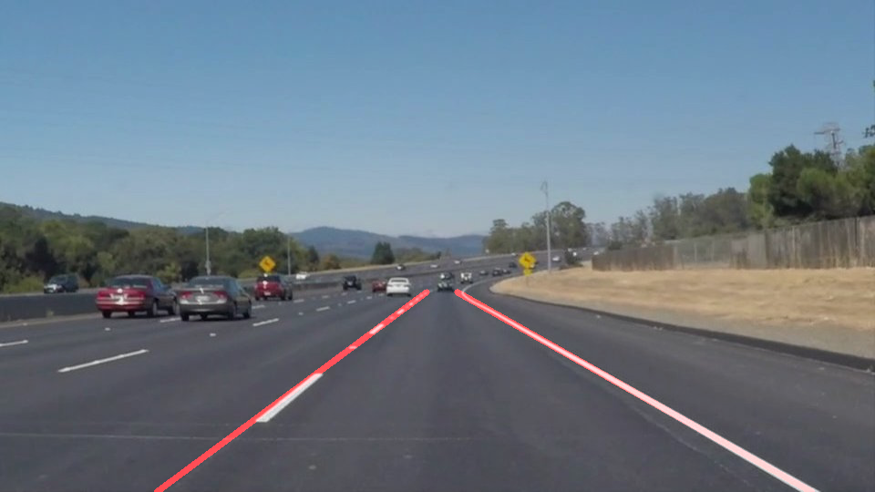

# **Finding Lane Lines on the Road** 

Overview
---

When we drive, we use our eyes to decide where to go.  The lines on the road that show us where the lanes are act as our constant reference for where to steer the vehicle.  Naturally, one of the first things we would like to do in developing a self-driving car is to automatically detect lane lines using an algorithm.

This project will show how to detect lane lines in images using Python and OpenCV.  OpenCV means "Open-Source Computer Vision", which is a package that has many useful tools for analyzing images.  

Objectives
---
1. Identify lane lines on the road and mark those in red.
2. Take image and videos as input and return an annotated image and video stream as output.
3. Identify potential shortcomings and suggest possble improvements.

Quick Example
---
Input Image:

Expected Output:

### Reflection

### 1. Pipeline of Project
1. Read in an image and grayscale it.
2. Apply Gaussian smoothing/blurring with a definedkernel size
3. Find edges through Canny
4. Define interested regions
5. Detect traffic lanes in the interested region through Hough Transform
6. Group lines to the left and right by checking its slope against certain criteria. Lines of which slope falling out the criteria will be disregarded.
8. Fit left/right pixels to a linear equation and populate continuous straight line with fitted equation. 
9. Merge populated lines with the original image

### 2. Potential Shortcomings
1. Unable to detect unclear lines in the challenge video.
2. Straight lines couldn't track lane with large curvature.

### 3. Suggest possible improvements
1. Identity lane color and specifically create a new layer of plot that only contains pixels of which color is close to lane color. This may help with finding unclear lanes.
2. Lanes with large curvature needs to be considered.

